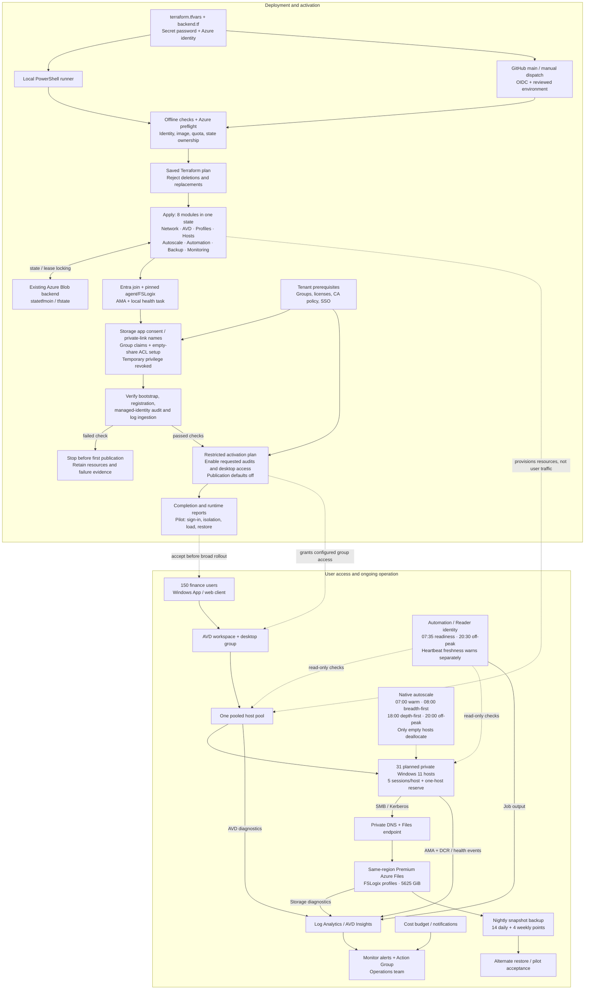

# SPORTFIVE whole workflow

Dashed arrows show deployment/control activity; solid runtime arrows show access and telemetry. Host/storage sizing is provisional. [Configuration, prerequisites and operating notes](docs/GUIDE.md).
